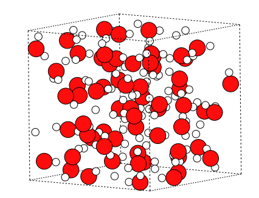
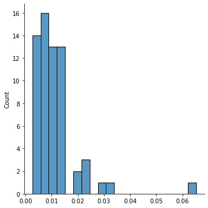
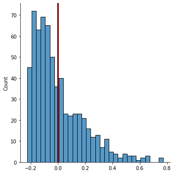
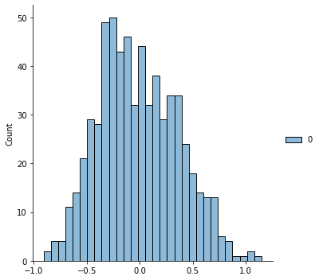

=====
Usage
=====

To use JAXIP in a project:

.. code:: python

    import jaxip

The following scripts demonstrate how to utilize various modules:

Initialization

.. code:: python

    import os
    os.environ["JAX_ENABLE_X64"] = "1"       # enabling double precision (float64)
    os.environ["JAX_PLATFORM_NAME"] = "cpu"  # enabling GPU-accelerated computing

Imports

.. code:: python

    from jaxip.types import dtype as default_dtype
    import jax.numpy as jnp
    import jax
    # default_dtype.FLOATX = jnp.float64

    import numpy as np
    from pathlib import Path
    import matplotlib.pylab as plt
    import seaborn as sns
    from tqdm import tqdm

Dataset
-------

.. code:: python

    base_dir = Path('./H2O_2')

RuNNer
''''''
Read `RuNNer <https://www.uni-goettingen.de/de/560580.html>`_ data format

.. code:: python

    from jaxip.datasets import RunnerStructureDataset
    structures = RunnerStructureDataset(Path(base_dir, "input.data"), persist=True)
    print("Total number of structures:", len(structures))
    structures

Output:

.. parsed-literal::

    Total number of structures: 1593
    RunnerStructureDataset(filename=PosixPath('H2O_2/input.data'), persist=True)

.. Data loader
.. '''''''''''

.. .. code:: python

..     # from torch.utils.data import DataLoader

.. Split train and validation structures
.. '''''''''''''''''''''''''''''''''''''

.. .. code:: python

..     # import torch
..     # validation_split = 0.032
..     # nsamples = len(structures)
..     # split = int(np.floor(validation_split * nsamples))
..     # train_structures, valid_structures = torch.utils.data.random_split(structures, lengths=[nsamples-split, split])
..     # structures = valid_structures

Structure
---------

.. code:: python

    s = structures[0]
    s

Output:

.. parsed-literal::

    Structure(natoms=192, elements=('H', 'O'), dtype=float32)

.. code:: python

    from ase.visualize import view
    from ase.io.vasp import write_vasp
    atoms = s.to_ase_atoms()
    view(atoms)
    # write_vasp('POSCAR', ase_atoms)

Compare between two structures
''''''''''''''''''''''''''''''

.. code:: python

    from jaxip.utils.compare import compare
    compare(structures[0], structures[1])

Output:

.. code:: python

    Comparing two structures, error metrics: RMSEpa
    {'force_RMSEpa': Array(0.06592743, dtype=float32),
    'energy_RMSEpa': Array(1.780192e-05, dtype=float32)}

Calculate distances
'''''''''''''''''''

.. code:: python

    dis, _ = s.calculate_distance(atom_index=0)

.. code:: python

    sns.displot(dis, bins=20)
    plt.axvline(dis.mean(), color='r')

.. image:: images/quick_start/output_22_1.png

.. Add/remove per-atom energy offset
.. '''''''''''''''''''''''''''''''''

.. .. code:: python

..     # structure = structures[0]
..     # atom_energy = {'O': 2.4, 'H': 1.2}
    
..     # structure.add_energy_offset(atom_energy)
..     # structure.total_energy

Descriptor
----------

Atomic environment descriptor

.. code:: python

    from jaxip.descriptors.acsf import ACSF, G2, G3, G9, CutoffFunction

ACSF
''''
Atomic-centered symmetry functions (ACSF)

.. code:: python

    acsf = ACSF('O')
    
    cfn = CutoffFunction(12.0)
    g2_1 = G2(cfn, 0.0, 0.001)
    g2_2 = G2(cfn, 0.0, 0.01)
    g3_1 = G3(cfn, 0.2, 1.0, 1.0, 0.0)
    g9_1 = G3(cfn, 0.2, 1.0, 1.0, 0.0)
    
    acsf.add(g2_1, 'H')
    acsf.add(g2_2, 'H')
    acsf.add(g3_1, 'H', 'H')
    acsf.add(g3_1, 'H', 'O')
    acsf.add(g9_1, 'H', 'O')
    acsf

Output:

.. parsed-literal::

    ACSF(element='O', size=5, r_cutoff=12.0)

Computing descriptor values
'''''''''''''''''''''''''''
.. code:: python

    val = acsf(s)
    val[1]

Output:

.. parsed-literal::

    DeviceArray([6.2318468e+00, 4.6910887e+00, 2.6130967e-03, 2.2319485e-04,
                 2.2319485e-04], dtype=float32)

.. code:: python

    sns.displot(val[:, 2], bins=20)

Gradient
''''''''

.. code:: python

    acsf.grad(s, 0, 3)

Output:

.. parsed-literal::

    DeviceArray([[-0.01492049,  0.02473107, -0.0606008 ]], dtype=float32)

Scaler
------

.. code:: python

    from jaxip.descriptors.scaler import DescriptorScaler

Fitting scaling parameters
''''''''''''''''''''''''''
.. code:: python

    scaler = DescriptorScaler(scale_type='scale_center')
    # acsf = nnp.descriptor["H"]
    
    for structure in tqdm(structures):
        x = acsf(structure)
        scaler.fit(x)
    
    scaler

.. parsed-literal::

    100%|██████████| 10/10 [00:00<00:00, 13.95it/s]

.. parsed-literal::

    DescriptorScaler(scale_type='scale_center', scale_min=0.0, scale_max=1.0)

Transforming descriptor values
''''''''''''''''''''''''''''''
.. code:: python

    scaled_x = []
    for structure in tqdm(structures):
        x = acsf(structure)
        scaled_x.append(scaler(x))
    
    scaled_x = jnp.concatenate(scaled_x, axis=0)
    scaled_x.shape

.. parsed-literal::

    100%|██████████| 10/10 [00:00<00:00, 16.46it/s]

.. code:: python

    sx = scaled_x[:, 5]
    sns.displot(sx, bins=30)
    plt.axvline(sx.mean(), color='r', lw=3);
    plt.axvline(0, color='k');

Model
-----

.. code:: python

    from jaxip.models.nn import NeuralNetworkModel
    from jaxip.models.initializer import UniformInitializer
    from flax import linen as nn

Building neural network
'''''''''''''''''''''''
.. code:: python

    nn = NeuralNetworkModel(
        hidden_layers=((8, 't'), (8, 't')),
        kernel_initializer=UniformInitializer(weights_range=(-1, 1)),
        # param_dtype=jnp.float64,
    )

.. code:: python

    rng = jax.random.PRNGKey(2022)                       # PRNG Key
    x = jnp.ones(shape=(8, acsf.num_symmetry_functions)) # Dummy Input
    params = nn.init(rng, x)                             # Initialize the parameters
    jax.tree_map(lambda x: x.shape, params)              # Check the parameters

.. parsed-literal::

    FrozenDict({
        params: {
            layers_0: {
                bias: (8,),
                kernel: (5, 8),
            },
            layers_2: {
                bias: (8,),
                kernel: (8, 8),
            },
            layers_4: {
                bias: (1,),
                kernel: (8, 1),
            },
        },
    })

Computing output energy
'''''''''''''''''''''''
.. code:: python

    eng = nn.apply(params, scaled_x[:, :])  # this is an untrained model

.. code:: python

    sns.displot(eng, bins=30);

