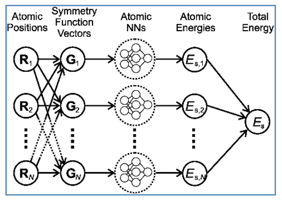

## Theoretical background

Force field molecular dynamics simulation (MD) is a powerful tool for exploring the equilibrium and transport properties of many-body systems on the atomic scale. Force field is in fact a estimated representation of interatomic interaction in a functional form which boost the computational efficiency and thus let us reach time and length scales far beyond what is possible with direct _ab initio_ molecular dynamics, where energy and forces are calculated on the fly. However, the power of such simulations would be enormously enhanced if the potentials used to simulate materials were not limited by the given functional forms but accurately represented the Born-Oppenheimer potential energy surface. Conventional force fields are typically constructed on the basis of physical assumptions and are therefore limited to specific functional forms which are less suitable for reactive large-scale MD simulations of materials with strong interfacial chemical characteristics.

To overcome this limitation, __data-intensive__ approach is beginning to emerge as a different paradigm. There are currently two different approaches that successfully apply machine learning methods to interatomic potential development 1) Gaussian approximated potential (GAP) [P. Rowe et al., Phys. Rev. B 97, 054303 (2018)] and 2) neural network potential (NNP) [J. Behler, J. Chem. Phys. 145, 170901 (2016)]. Both frameworks rely purely on atomic energy and forces data obtained from first-principles calculations (e.g. DFT techniques) and attempt to realize an accurate representation of the potential energy surface. This is achieved at a computational __efficiency__ which is orders of magnitude larger than that of comparable calculations which directly invoke electronic structure methods while preserving quantum mechanical __accuracy__.

#### High-dimensional NNP
High-dimensional neural network potentials are constructed using the method proposed by Behler and Parrinello. The total energy of the system is determined as a sum of environment-dependent atomic energies. For each atom in the system, the positions of all neighboring atoms inside a cutoff radius are described by a set of atom-centered many-body symmetry functions. These sets of function values are then used as input features for the atomic neural networks that give the atomic energy contributions and
corresponding derivatives as force components applied on each atom.

Figure 1 - High-dimensional
neural network potential.

### References
[1] 